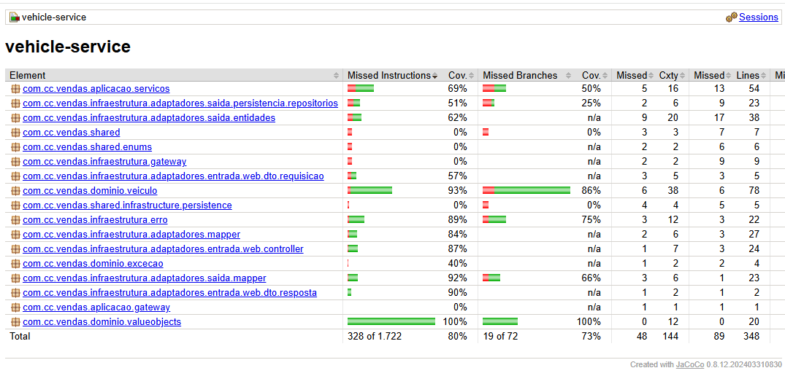

# Serviço cadastro e gerenciamento dos veículos

## Responsabilidades

- Cadastrar veículo
- Editar veículo
- Manter informações do veículo
- Saber se o veículo está disponível ou vendido
- Receber requisições do serviço de vendas
- Disponibilizar APIs para consulta de veículo

### Endpoints

GET    /veiculos/disponiveis

GET    /veiculos/vendidos

GET    /veiculos/{id}

POST   /veiculos

PUT    /veiculos/{id}

PATCH  /veiculos/atualizar-status{id}

## Cobertura de Testes

